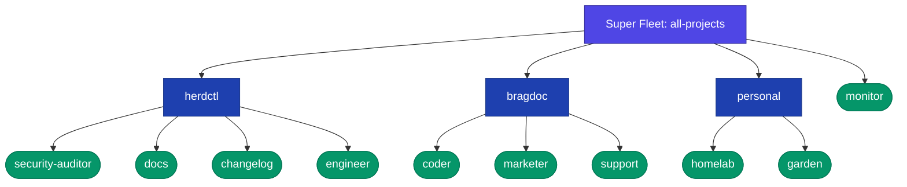
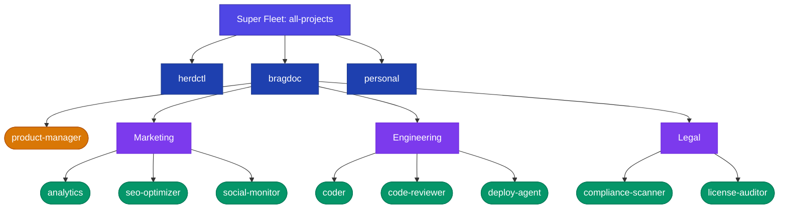

**Fleet composition** lets you combine multiple project fleets into a unified "super fleet" — a fleet of fleets. This mirrors how engineering organizations actually work: individual projects each have their own set of agents, but a person or team manages many projects simultaneously.

## What is Fleet Composition?



*One FleetManager · One scheduler · One web dashboard*

A super fleet references other fleet config files. At load time, herdctl recursively resolves all sub-fleet YAML files and flattens every agent into a single list. At runtime, it's one FleetManager, one scheduler, one state directory — the hierarchy is purely organizational.

## Why Compose Fleets?

### Multi-Project Management

As you adopt herdctl across more projects, each project naturally gets its own fleet of agents. Fleet composition lets you run them all from a single `herdctl start` command and monitor them in one dashboard.

A typical setup might look like: your open source project has security, docs, and engineering agents; your SaaS product has its own set; and you have personal agents for the homelab and garden. Instead of running three separate fleet processes, you compose them into one.

### Sub-Teams in Large Projects

A large project can benefit from grouping agents by function. Marketing agents might grab analytics, optimize SEO, and monitor social sentiment. Engineering agents handle code review and deployment. Legal agents scan for compliance issues.



With fleet composition, each team can maintain their own fleet config in their own repo, and a central super-fleet brings them all together. The marketing team owns their agent definitions; engineering provides the infrastructure.

### Shared Infrastructure

Composition gives you a single web dashboard, a single scheduler process, and a unified CLI for everything. There's no need to remember which port each project's dashboard runs on or which terminal has which fleet. One process, one view.

## How It Works

The key design principle: the fleet hierarchy is a **config-loading concern**, not a runtime concern.

When herdctl loads a super-fleet config, the config loader:

1. Reads the root fleet's `fleets` array
2. For each sub-fleet reference, loads and parses that YAML file
3. Recursively processes any `fleets` entries in the sub-fleets
4. Flattens all discovered agents into a single `ResolvedAgent[]` list
5. Annotates each agent with its fleet path (e.g., `["herdctl"]` or `["project", "frontend"]`)

From that point on, FleetManager, the scheduler, the job system, and the web dashboard all work with a flat list of agents — exactly like a single fleet. The only difference is that each agent carries metadata about which sub-fleet it belongs to.

This means there is no performance overhead from nesting. Whether you have one fleet or five nested levels, the runtime behavior is identical.

## Configuring a Super-Fleet

Add a `fleets` array to your root `herdctl.yaml` alongside (or instead of) the `agents` array:

```yaml
version: 1

fleet:
  name: all-projects

web:
  enabled: true
  port: 3232

fleets:
  - path: ./herdctl/herdctl.yaml
  - path: ./bragdoc/herdctl.yaml
  - path: ./personal/herdctl.yaml
    name: personal               # Override sub-fleet's name

agents:                           # Direct agents still supported
  - path: ./global-agents/monitor.yaml
```

A fleet can have both `fleets` and `agents`, or just one of either. Each sub-fleet is itself a standard `herdctl.yaml` — the same file you'd use to run that project's fleet standalone. No modifications needed.

## Qualified Names

When agents from multiple sub-fleets are merged into a single flat list, they need globally unique identifiers. herdctl computes a **qualified name** by joining the fleet hierarchy path with the agent's local name using dots:

| Fleet Path | Agent Name | Qualified Name |
|---|---|---|
| `["herdctl"]` | `security-auditor` | `herdctl.security-auditor` |
| `["herdctl"]` | `engineer` | `herdctl.engineer` |
| `["bragdoc"]` | `coder` | `bragdoc.coder` |
| `["personal"]` | `homelab` | `personal.homelab` |
| `[]` (root) | `monitor` | `monitor` |

**Key rules:**

- The **root fleet's name is not included** in qualified names. There is only one root, so it adds noise without disambiguation value.
- Agents directly on the root fleet have a qualified name equal to their local name. This means **single-fleet setups are completely unaffected** — no naming changes at all.
- The `.` (period) is the separator. Agent names cannot contain dots (the name regex forbids them), so the separator is always unambiguous.

Use qualified names with CLI commands:

```bash
# Trigger a sub-fleet agent
herdctl trigger herdctl.security-auditor

# Check status of a specific agent
herdctl status bragdoc.coder

# Root-level agents use their local name as before
herdctl trigger monitor
```

## Fleet Name Resolution

Sub-fleets need names to form qualified agent names. herdctl resolves the name using this priority:

1. **Parent's explicit `name`** — the `name` field on the fleet reference (highest priority)
2. **Sub-fleet's own `fleet.name`** — from the sub-fleet's config file
3. **Directory name** — derived from the sub-fleet config file's directory

```yaml
fleets:
  # Uses explicit name "herdctl" (priority 1)
  - path: ~/projects/herdctl/herdctl.yaml
    name: herdctl

  # Uses sub-fleet's fleet.name from its config (priority 2)
  - path: ~/projects/bragdoc/herdctl.yaml

  # Falls back to directory name "personal" (priority 3)
  - path: ~/projects/personal/herdctl.yaml
```

Fleet names must match the pattern `^[a-zA-Z0-9][a-zA-Z0-9_-]*$` — letters, numbers, hyphens, and underscores. No dots, since dots are reserved as the hierarchy separator.

## Defaults and Overrides

When composing fleets, configuration values merge across levels. The merge priority from lowest to highest:

1. **Super-fleet `defaults`** — gap-filler, only applies where nothing else is set
2. **Sub-fleet `defaults`** — the sub-fleet's own defaults for its agents
3. **Agent's own config** — what the agent YAML specifies directly
4. **Per-agent `overrides`** — from the sub-fleet's `agents` entry
5. **Per-fleet `overrides`** — from the super-fleet's `fleets` entry (highest priority)

```yaml
# Super-fleet: sets a default model for everyone
defaults:
  model: claude-sonnet-4-20250514

fleets:
  - path: ./herdctl/herdctl.yaml
    # herdctl agents use sonnet (from super-fleet defaults)

  - path: ./critical-project/herdctl.yaml
    overrides:
      defaults:
        model: claude-opus-4-20250514  # Force all agents in this sub-fleet to use Opus
```

Fleet-level overrides apply to the sub-fleet's top-level config fields (`defaults`, `web`, etc.). They cannot reach into individual agent configs — if you need to override a specific agent, import it directly as an agent reference with overrides.

## Web Dashboard

Only the **root fleet's** web configuration is honored. Sub-fleet web configurations are automatically suppressed during loading. This ensures a single dashboard serves all agents across all sub-fleets.

The sidebar groups agents by fleet hierarchy:

```
▼ herdctl
    ● security-auditor   (running)
    ○ engineer           (idle)
    ○ docs               (idle)
    ○ changelog          (idle)
▼ bragdoc
    ○ coder              (idle)
    ○ marketer           (idle)
    ○ support            (idle)
▼ personal
    ○ homelab            (idle)
    ○ garden             (idle)
○ monitor                (idle)
```

This sidebar tree is intentionally kept as text — it represents the actual Web Dashboard sidebar rendering, not an architectural diagram.

Agents directly on the root fleet appear ungrouped at the top level. Sub-fleets render as collapsible sections.

## Chat Connectors

Chat integrations (Discord, Slack) are tied to individual agents, not to the fleet. When a sub-fleet is imported, its agents' chat configurations remain fully active — they are **not** suppressed like web configs.

This makes sense: a sub-fleet's support agent with a Discord bot should keep working regardless of whether it's running standalone or as part of a super-fleet.

## Safety

Fleet composition includes several safeguards:

### Cycle Detection

If fleet A references fleet B which references fleet A, the config loader detects the cycle and fails with a clear error showing the chain:

```
Fleet cycle detected: all-projects.yaml → herdctl.yaml → all-projects.yaml
```

### Fleet Name Collisions

If two sub-fleets at the same level resolve to the same name, loading fails with an error suggesting the use of explicit `name` overrides to disambiguate:

```
Fleet name collision: "herdctl" is used by both
  ./projects/herdctl/herdctl.yaml and ./other/herdctl/herdctl.yaml
Use explicit 'name' overrides to disambiguate.
```

### Fleet Name Validation

Fleet names must match the same identifier pattern as agent names. If a resolved name contains invalid characters (including dots), loading fails with a clear message.

## Related Concepts

- [Agents](/concepts/agents/) — Individual agent configuration and lifecycle
- [Fleet Configuration](/configuration/fleet-config/) — Full YAML reference for `fleets`, overrides, and all fleet-level options
- [Schedules](/concepts/schedules/) — When and how agents execute tasks
- [Jobs](/concepts/jobs/) — Individual agent execution instances
