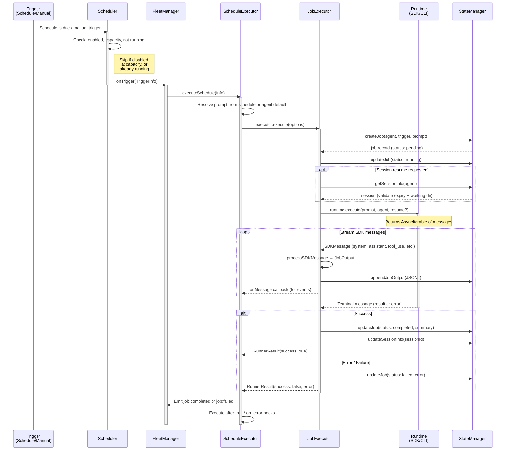

A **Job** represents a single execution of an agent. Each time an agent runs—whether triggered by a schedule, manual invocation, or trigger event—herdctl creates a job to track that execution from start to finish.

## Job Properties

| Property | Type | Description |
|----------|------|-------------|
| `id` | string | Unique job identifier (UUID) |
| `agent` | string | Name of the agent executing this job |
| `schedule` | string | Schedule that triggered this job (if scheduled) |
| `status` | enum | Current job status |
| `exitReason` | enum | Why the job ended (set on completion) |
| `sessionId` | string | Claude session ID for resume capability |
| `startedAt` | timestamp | When the job started execution |
| `completedAt` | timestamp | When the job finished (success or failure) |
| `output` | string | Path to job output file (JSONL format) |
| `error` | string | Error message if job failed |

## Job Lifecycle

Jobs progress through a defined lifecycle:

```
PENDING → RUNNING → COMPLETED
                  → FAILED
                  → CANCELLED
```

### Execution Flow

The following diagram shows the full journey of a job from trigger to completion, including how the major components interact:



The key participants in this flow are:

- **Trigger**: A schedule firing (interval/cron) or a manual `herdctl trigger` command
- **Scheduler**: Polls schedules and checks whether they are due, respecting concurrency limits
- **FleetManager**: Top-level orchestrator that wires everything together
- **ScheduleExecutor**: Handles the bridge between scheduler triggers and job execution
- **JobExecutor**: Manages the full lifecycle of a single job -- creating records, streaming output, and updating final status
- **Runtime**: The execution backend (Claude Agent SDK or CLI) that actually runs the agent and returns a stream of messages
- **StateManager**: Persists job metadata, JSONL output, and session info to `.herdctl/`

### Status Definitions

| Status | Description |
|--------|-------------|
| `running` | Job is currently executing |
| `completed` | Job finished successfully |
| `failed` | Job terminated due to an error |
| `cancelled` | Job was manually stopped |

## Exit Reasons

When a job completes, it records an exit reason explaining why it ended:

| Exit Reason | Description |
|-------------|-------------|
| `end_turn` | Job completed naturally |
| `stop_sequence` | Job hit a stop sequence |
| `max_turns` | Job reached maximum conversation turns |
| `timeout` | Job exceeded its configured time limit |
| `interrupt` | Job was cancelled by user intervention |
| `error` | Job failed due to an error |

### Example Job Record

```json
{
  "id": "job-550e8400-e29b",
  "agent": "bragdoc-coder",
  "schedule": "daily-standup",
  "status": "completed",
  "exitReason": "success",
  "sessionId": "sess-a1b2c3d4",
  "startedAt": "2024-01-15T09:00:00Z",
  "completedAt": "2024-01-15T09:15:32Z",
  "output": "~/.herdctl/jobs/job-550e8400-e29b/output.jsonl"
}
```

## Job Output Format

Job output is stored in **JSONL (JSON Lines)** format, where each line is a separate JSON object representing an event during execution:

```jsonl
{"type":"start","timestamp":"2024-01-15T09:00:00Z","message":"Job started"}
{"type":"tool_use","timestamp":"2024-01-15T09:00:05Z","tool":"Read","file":"src/index.ts"}
{"type":"output","timestamp":"2024-01-15T09:00:10Z","content":"Reading file contents..."}
{"type":"tool_use","timestamp":"2024-01-15T09:00:15Z","tool":"Edit","file":"src/index.ts"}
{"type":"complete","timestamp":"2024-01-15T09:15:32Z","exitReason":"success"}
```

### Output Event Types

| Type | Description |
|------|-------------|
| `start` | Job execution began |
| `output` | Text output from Claude |
| `tool_use` | Tool invocation |
| `tool_result` | Tool execution result |
| `error` | Error occurred |
| `complete` | Job finished |

### Viewing Job Output

```bash
# View logs for a specific job
herdctl logs --job <job-id>

# View logs for an agent (shows recent jobs)
herdctl logs <agent-name>

# Follow logs in real-time
herdctl logs <agent-name> --follow

# Export to file
herdctl logs --job <job-id> > job-output.log
```

## Working with Jobs

### Viewing Agent and Job Status

```bash
# Show all agents and their status
herdctl status

# Show specific agent status
herdctl status <agent-name>
```

### Cancelling Jobs

```bash
# Cancel a running job
herdctl cancel <job-id>
```

## Session Resume

Jobs store their Claude session ID, enabling resume after interruption. This is useful when:

- Network connectivity was lost
- The system was restarted during execution
- You want to continue an agent's work interactively

```bash
# Resume the most recent session
herdctl sessions resume

# Resume by session ID (supports partial match)
herdctl sessions resume <session-id>

# Resume by agent name
herdctl sessions resume <agent-name>
```

See [Sessions](/concepts/sessions/) for more details on session management and resume capabilities.

## Job Storage

Jobs are persisted to disk for history and recovery. See [State Management](/internals/state-management/) for details on storage backends and configuration.

```
~/.herdctl/
├── jobs/
│   └── <job-id>/
│       ├── job.json      # Job metadata
│       └── output.jsonl  # Execution output
└── logs/
    └── <agent>/
        └── <job-id>.log  # Agent-specific logs
```

## Related Concepts

- [Agents](/concepts/agents/) - What executes jobs
- [Schedules](/concepts/schedules/) - What triggers scheduled jobs
- [Triggers](/concepts/triggers/) - What triggers event-based jobs
- [Sessions](/concepts/sessions/) - Job execution context
- [State Management](/internals/state-management/) - Job storage and persistence
