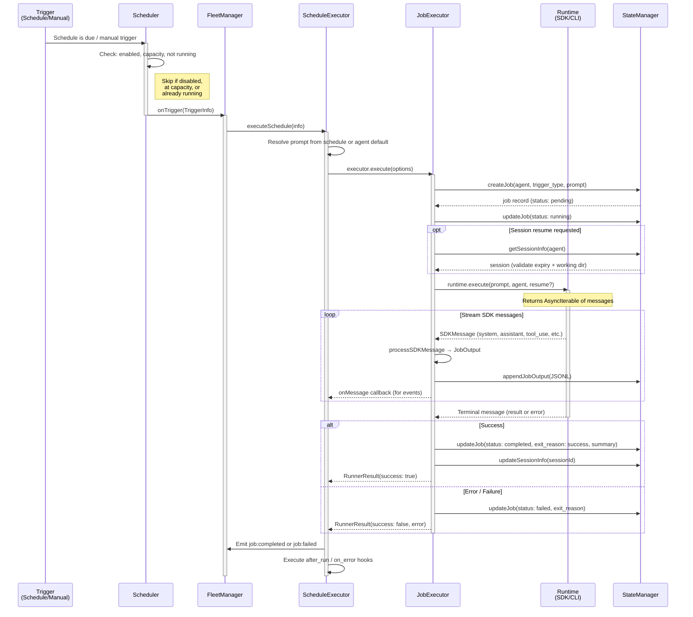

A **Job** represents a single execution of an agent. Each time an agent runs—whether triggered by a schedule, manual invocation, or trigger event—herdctl creates a job to track that execution from start to finish.

## Job Properties

Each job is stored as a YAML metadata file with these fields:

| Property | Type | Description |
|----------|------|-------------|
| `id` | string | Unique job identifier, format `job-YYYY-MM-DD-<random6>` (e.g., `job-2025-01-15-k2x9qa`) |
| `agent` | string | Name of the agent executing this job |
| `schedule` | string \| null | Schedule that triggered this job (if scheduled) |
| `trigger_type` | enum | How the job was triggered: `manual`, `schedule`, `webhook`, `chat`, `discord`, `slack`, `web`, or `fork` |
| `status` | enum | Current job status |
| `exit_reason` | enum \| null | Why the job ended (set on completion) |
| `session_id` | string \| null | Claude session ID for resume capability |
| `forked_from` | string \| null | Parent job ID when `trigger_type` is `fork` |
| `started_at` | ISO timestamp | When the job started |
| `finished_at` | ISO timestamp \| null | When the job finished (null while running) |
| `duration_seconds` | number \| null | Job duration, calculated when finished |
| `prompt` | string \| null | The prompt given to the agent |
| `summary` | string \| null | Brief summary of what the job accomplished |
| `output_file` | string \| null | Path to the JSONL output file |

## Job Lifecycle

Jobs progress through a defined lifecycle:

```
pending → running → completed
                  → failed
                  → cancelled
```

### Execution Flow

The following diagram shows the full journey of a job from trigger to completion, including how the major components interact:


```mermaid
sequenceDiagram
    participant Trigger as Trigger<br/>(Schedule/Manual)
    participant Scheduler
    participant FM as FleetManager
    participant SE as ScheduleExecutor
    participant JE as JobExecutor
    participant RT as Runtime<br/>(SDK/CLI)
    participant State as StateManager

    Trigger->>Scheduler: Schedule is due / manual trigger
    activate Scheduler
    Scheduler->>Scheduler: Check: enabled, capacity, not running
    Note right of Scheduler: Skip if disabled,<br/>at capacity, or<br/>already running
    Scheduler->>FM: onTrigger(TriggerInfo)
    deactivate Scheduler

    activate FM
    FM->>SE: executeSchedule(info)
    activate SE
    SE->>SE: Resolve prompt from schedule or agent default
    SE->>JE: executor.execute(options)
    activate JE

    JE->>State: createJob(agent, trigger_type, prompt)
    State-->>JE: job record (status: pending)

    JE->>State: updateJob(status: running)

    opt Session resume requested
        JE->>State: getSessionInfo(agent)
        State-->>JE: session (validate expiry + working dir)
    end

    JE->>RT: runtime.execute(prompt, agent, resume?)
    activate RT
    Note over RT: Returns AsyncIterable of messages

    loop Stream SDK messages
        RT-->>JE: SDKMessage (system, assistant, tool_use, etc.)
        JE->>JE: processSDKMessage → JobOutput
        JE->>State: appendJobOutput(JSONL)
        JE-->>SE: onMessage callback (for events)
    end

    RT-->>JE: Terminal message (result or error)
    deactivate RT

    alt Success
        JE->>State: updateJob(status: completed, exit_reason: success, summary)
        JE->>State: updateSessionInfo(sessionId)
        JE-->>SE: RunnerResult(success: true)
    else Error / Failure
        JE->>State: updateJob(status: failed, exit_reason)
        JE-->>SE: RunnerResult(success: false, error)
    end
    deactivate JE

    SE->>FM: Emit job:completed or job:failed
    SE->>SE: Execute after_run / on_error hooks
    deactivate SE
    deactivate FM
```

The key participants in this flow are:

- **Trigger**: A schedule firing (interval/cron) or a manual `herdctl trigger` command
- **Scheduler**: Polls schedules and checks whether they are due, respecting concurrency limits
- **FleetManager**: Top-level orchestrator that wires everything together
- **ScheduleExecutor**: Handles the bridge between scheduler triggers and job execution
- **JobExecutor**: Manages the full lifecycle of a single job -- creating records, streaming output, and updating final status
- **Runtime**: The execution backend (Claude Agent SDK or CLI) that actually runs the agent and returns a stream of messages
- **StateManager**: Persists job metadata, JSONL output, and session info to `.herdctl/`

### Status Definitions

| Status | Description |
|--------|-------------|
| `pending` | Job record created, execution not yet started |
| `running` | Job is currently executing |
| `completed` | Job finished successfully |
| `failed` | Job terminated due to an error |
| `cancelled` | Job was manually stopped |

## Exit Reasons

When a job finishes, it records an exit reason explaining why it ended:

| Exit Reason | Description |
|-------------|-------------|
| `success` | Job completed naturally |
| `error` | Job failed due to an error |
| `timeout` | Job exceeded its configured time limit |
| `cancelled` | Job was cancelled by user intervention |
| `max_turns` | Job reached maximum conversation turns |

### Example Job Record

Job metadata is stored as YAML (`.herdctl/jobs/<job-id>.yaml`):

```yaml
id: job-2025-01-15-k2x9qa
agent: bragdoc-coder
schedule: issue-check
trigger_type: schedule
status: completed
exit_reason: success
session_id: a1b2c3d4-5678-90ab-cdef-1234567890ab
forked_from: null
started_at: "2025-01-15T09:00:00.000Z"
finished_at: "2025-01-15T09:15:32.000Z"
duration_seconds: 932
prompt: "Check for ready issues and implement the oldest one."
summary: "Implemented issue #42: fixed authentication timeout."
output_file: .herdctl/jobs/job-2025-01-15-k2x9qa.jsonl
```

## Job Output Format

Job output is stored in **JSONL (JSON Lines)** format, where each line is a separate JSON object representing a message during execution:

```jsonl
{"type":"system","timestamp":"2025-01-15T09:00:00Z","subtype":"init","content":"Session started"}
{"type":"assistant","timestamp":"2025-01-15T09:00:05Z","content":"I'll start by reading the issue."}
{"type":"tool_use","timestamp":"2025-01-15T09:00:10Z","tool_name":"Read","tool_use_id":"toolu_01","input":{"file_path":"src/index.ts"}}
{"type":"tool_result","timestamp":"2025-01-15T09:00:11Z","tool_use_id":"toolu_01","success":true,"result":"..."}
{"type":"assistant","timestamp":"2025-01-15T09:15:30Z","content":"Done. The fix is in src/index.ts."}
```

### Output Message Types

| Type | Description |
|------|-------------|
| `system` | System message (e.g., session init), with optional `subtype` |
| `assistant` | Text output from Claude, with optional token `usage` |
| `tool_use` | Tool invocation (`tool_name`, `tool_use_id`, `input`) |
| `tool_result` | Tool execution result (`result`, `success`, `error`) |
| `error` | Error occurred (`message`, `code`, `stack`) |

## Working with Jobs

The primary commands for inspecting jobs are `herdctl jobs` (list) and `herdctl job <id>` (detail):

```bash
# List recent jobs (default: 20)
herdctl jobs

# Filter by agent or status
herdctl jobs --agent bragdoc-coder
herdctl jobs --status failed

# Show more jobs, or output JSON for scripting
herdctl jobs --limit 50
herdctl jobs --json

# Show details for a specific job
herdctl job job-2025-01-15-k2x9qa

# Show a job's full output
herdctl job job-2025-01-15-k2x9qa --logs
```

### Viewing Job Output as Logs

The `herdctl logs` command streams job output per agent or per job:

```bash
# View logs for an agent (shows recent jobs)
herdctl logs <agent-name>

# View logs for a specific job
herdctl logs --job <job-id>

# Follow logs in real-time
herdctl logs <agent-name> --follow

# Control how many lines are shown (default: 50)
herdctl logs <agent-name> --lines 200
```

### Viewing Agent and Job Status

```bash
# Show all agents and their status
herdctl status

# Show specific agent status
herdctl status <agent-name>
```

### Cancelling Jobs

```bash
# Cancel a running job (prompts for confirmation)
herdctl cancel <job-id>

# Skip confirmation, or force-kill (SIGKILL)
herdctl cancel <job-id> --yes
herdctl cancel <job-id> --force
```

## Session Resume

Jobs store their Claude session ID, enabling resume after interruption. This is useful when:

- Network connectivity was lost
- The system was restarted during execution
- You want to continue an agent's work interactively

```bash
# Resume the most recent session
herdctl sessions resume

# Resume by session ID (supports partial match)
herdctl sessions resume <session-id>

# Resume by agent name
herdctl sessions resume <agent-name>
```

See [Sessions](/concepts/sessions/) for more details on session management and resume capabilities.

## Job Storage

Jobs are persisted to the project-local `.herdctl/` state directory (configurable with `--state`). Metadata and output live side by side as flat files named by job ID:

```
.herdctl/
└── jobs/
    ├── job-2025-01-15-k2x9qa.yaml   # Job metadata
    ├── job-2025-01-15-k2x9qa.jsonl  # Execution output (JSONL)
    └── job-2025-01-15-k2x9qa/       # Only when a schedule sets outputToFile: true
        └── output.log               # Plain-text output log
```

See [State Management](/architecture/state-management/) for details on the state directory.

## Related Concepts

- [Agents](/concepts/agents/) - What executes jobs
- [Schedules](/concepts/schedules/) - What triggers scheduled jobs
- [Triggers](/concepts/triggers/) - What triggers event-based jobs
- [Sessions](/concepts/sessions/) - Job execution context
- [State Management](/architecture/state-management/) - Job storage and persistence
