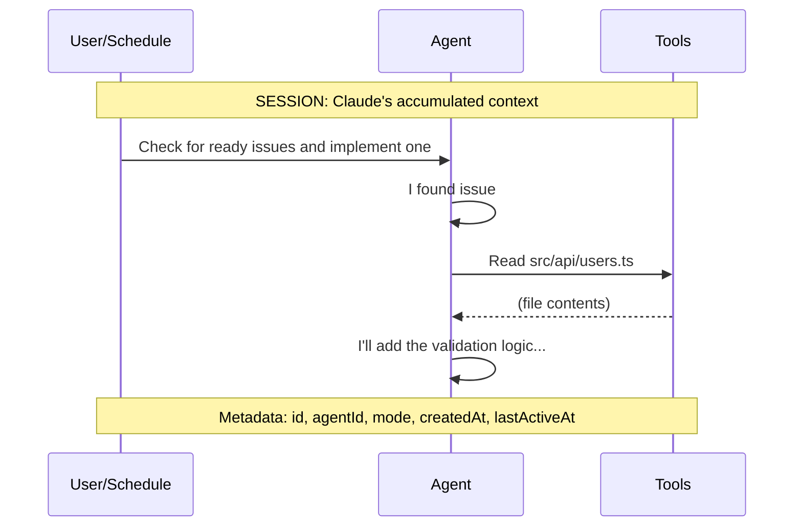

A **Session** represents a Claude Code execution context. Sessions manage conversation history, context persistence, and enable resume and fork capabilities across job executions. Understanding session management is essential for controlling how your agents maintain (or reset) their context over time.

## What is a Session?

When Claude Code executes, it maintains a conversation context—the accumulated history of messages, tool uses, and responses. A session encapsulates this context, allowing herdctl to:

- **Persist context** across multiple job executions
- **Resume** interrupted work from exactly where it left off
- **Fork** existing sessions to explore alternative approaches
- **Isolate** conversations per channel in chat integrations



## Session Modes

herdctl supports three session modes that control how context is managed across job executions:

### fresh_per_job

Each job starts with a completely fresh session—no prior context from previous runs.

```yaml
session:
  mode: fresh_per_job
```

**Use cases:**
- Stateless tasks that should start clean each time
- Jobs where prior context might cause confusion
- High-security scenarios requiring context isolation

**Behavior:**
- New session created for every job execution
- No conversation history carried forward
- Previous sessions are archived but not used

```
Job 1 → Session A (fresh) → Completed
Job 2 → Session B (fresh) → Completed  # No memory of Job 1
Job 3 → Session C (fresh) → Completed  # No memory of Jobs 1 or 2
```

### persistent

Maintains context across multiple job executions. The agent "remembers" previous work.

```yaml
session:
  mode: persistent
```

**Use cases:**
- Long-running projects requiring continuity
- Agents that build on previous work
- Tasks where context improves performance

**Behavior:**
- Session persists across job executions
- Conversation history accumulates
- Context is automatically summarized when it grows large

```
Job 1 → Session A → Completed (context saved)
Job 2 → Session A → Completed (continues with Job 1's context)
Job 3 → Session A → Completed (continues with Jobs 1+2 context)
```

**Configuration options:**

```yaml
session:
  mode: persistent
  max_context_tokens: 100000   # Summarize when exceeded
  context_window: 50           # Keep last N messages in full detail
```

### per_channel

Creates separate sessions for each communication channel. Ideal for chat integrations where different channels represent different conversations or users.

```yaml
session:
  mode: per_channel
```

**Use cases:**
- Discord/Slack bot integrations
- Multi-user support scenarios
- Channel-specific context isolation

**Behavior:**
- Each channel gets its own persistent session
- Context is isolated between channels
- Sessions are identified by channel ID

```
Discord #general  → Session A (persistent within channel)
Discord #support  → Session B (separate context)
Slack #dev        → Session C (separate context)
```

**Example configuration:**

Each chat-enabled agent has its own Discord bot (created in Discord Developer Portal), appearing as a distinct "person" in chat.

```yaml
name: project-support
description: "Answers questions in Discord channels"
workspace: my-project
repo: owner/my-project

chat:
  discord:
    bot_token_env: SUPPORT_DISCORD_TOKEN  # This agent's own bot
    guilds:
      - id: "guild-id-here"
        channels:
          - id: "123456789"       # #general
            mode: mention
          - id: "987654321"       # #support
            mode: auto

session:
  mode: per_channel           # Separate context per channel
  timeout: 24h                # Session expires after 24h inactivity
```

## Session Properties

| Property | Type | Description |
|----------|------|-------------|
| `id` | string | Unique session identifier |
| `agentId` | string | Agent that owns this session |
| `mode` | enum | Session mode (fresh_per_job, persistent, per_channel) |
| `channelId` | string | Channel ID (for per_channel mode) |
| `status` | enum | Current session status |
| `createdAt` | timestamp | When session was created |
| `lastActiveAt` | timestamp | Last activity timestamp |
| `messageCount` | number | Number of messages in context |
| `tokenEstimate` | number | Estimated context token count |

## Session Lifecycle

Sessions progress through defined states:

```
CREATED → ACTIVE → PAUSED → COMPLETED
                 → EXPIRED
```

| Status | Description |
|--------|-------------|
| `created` | Session initialized, not yet used |
| `active` | Claude is currently executing within this session |
| `paused` | Session suspended, ready for resume |
| `completed` | Session finished successfully |
| `expired` | Session timed out due to inactivity |

## Resume Capability

Sessions store Claude's conversation context, enabling powerful recovery scenarios:

### Automatic Resume

When a job is interrupted (network issues, system restart), herdctl can automatically resume:

```yaml
session:
  mode: persistent
  auto_resume: true           # Automatically resume interrupted jobs
  resume_timeout: 1h          # Only auto-resume within 1 hour
```

### Manual Resume

Resume an agent's session interactively with Claude Code:

```bash
# Resume the most recent session
herdctl sessions resume

# Resume a specific session by ID (supports partial match)
herdctl sessions resume a166a1e4

# Resume by agent name
herdctl sessions resume bragdoc-coder
```

This launches Claude Code in the agent's workspace with the full conversation history restored, allowing you to continue the work interactively.

### Resume Behavior

When resuming:
1. Full conversation history is restored
2. Claude receives context about the interruption
3. Execution continues from the last known state

```
Original Job:
  Message 1 → Message 2 → Message 3 → [INTERRUPTED]

Resumed Job:
  Message 1 → Message 2 → Message 3 → [System: Resuming...] → Message 4
```

## Fork Capability

Fork an existing session to explore alternative approaches without affecting the original:

```bash
# Fork a session at its current state
herdctl session fork <session-id>

# Fork and immediately start a new job
herdctl session fork <session-id> --run --prompt "Try a different approach"

# Fork from a specific point in history
herdctl session fork <session-id> --at-message 5
```

### Forking from the Library

Programmatically, pass `fork` to `FleetManager.trigger()`. The run resumes the source session's transcript as context but writes all new turns to a **brand-new session ID** (via Claude Code's `--fork-session`), leaving the source session untouched:

```typescript
const job = await manager.trigger('my-agent', undefined, {
  fork: 'source-session-id',        // Mutually exclusive with `resume`
  forkedFrom: 'job-2026-07-01-abc123', // Optional lineage metadata
  prompt: 'Try a different approach from here',
});
```

The child session ID is reported the same way a fresh session's is — on the `system`/`init` message and on the final result. `fork` and `resume` are mutually exclusive; when both are set, `fork` takes precedence. See the [trigger() reference](/library-reference/fleet-manager/#triggeragentname-schedulename-options) for details.

### Fork Use Cases

1. **Experimentation**: Try different solutions without losing progress
2. **A/B Testing**: Compare approaches from the same starting point
3. **Rollback**: Return to a known good state

```
Original Session:
  M1 → M2 → M3 → M4 → M5 (current)
                 ↓
Forked Session:  M4' → M5' (different approach)
```

## Streaming Chat Sessions

Beyond one-shot job triggers, herdctl can hold a **live, multi-turn streaming session** with an agent. `FleetManager.openChatSession()` returns a `RuntimeSession` handle that supports sending follow-up turns (`send()`), interrupting a runaway turn without losing the session (`interrupt()`), discovering the available slash commands (`listCommands()`), and switching models mid-conversation (`setModel()`). Slash commands are just user messages — sending `"/compact"` runs the command in-session.

Streaming sessions always run on the SDK runtime, even for `runtime: cli` agents (they share the same auth and on-disk session store); only Docker-wrapped agents are unsupported. This is the primitive behind interactive chat UIs like the web dashboard.

See [openChatSession() in the FleetManager reference](/library-reference/fleet-manager/#openchatsessionagentname-options) for the full API.

## Managed Session Lifecycle (Reaping and Wakes)

A live streaming session keeps a warm `claude` process around (~300 MB each). Sessions opened with `manageLifecycle: true` opt in to herdctl-managed lifecycle:

- **Reap on idle** — the session is closed the instant its turn ends, *unless* it holds live background work (running shells, subagents, monitors). Resuming later recovers the full conversation, and Claude's prompt cache is server-side and survives the reap, so closing an idle session costs only ~0.5s of respawn time.
- **Durable wakes** — timer-class wakeups the agent scheduled in-session (`ScheduleWakeup` one-shots, `CronCreate` recurring crons) would normally die with the `claude` process. Instead, herdctl captures them as durable wake entries in `state.yaml` (`session_wakes`) and re-fires them from its own scheduler loop, resuming the session with the wake's prompt.

Wake semantics:

| Behavior | Rule |
|----------|------|
| One-shot wakes | Fire once, then removed |
| Recurring wakes | Re-arm after each fire; auto-expire **7 days** after capture |
| Timezone | Cron expressions resolve in the **host's local timezone**, not UTC (matching how Claude Code serializes them) |
| Live sessions | A due wake is skipped while its session is still open — the session's own next turn re-captures it |
| Persistence | Wake entries survive fleet restarts (stored in `state.yaml`) |

Consumers that want to deliver woken turns somewhere (e.g. a chat UI) register a handler via `FleetManager.setSessionWakeHandler()`; without one, herdctl drains the woken turn headlessly so recurring wakes keep firing.

See [Session Lifecycle Methods](/library-reference/fleet-manager/#session-lifecycle-methods) for the API and [State Persistence](/architecture/state-management/#session-wakes) for the on-disk format.

## Example Configurations

### Stateless Coder Agent

For a coder that should evaluate each issue fresh:

```yaml
name: stateless-coder
description: "Implements features without prior context"
workspace: my-project
repo: owner/my-project

schedules:
  - name: issue-check
    trigger:
      type: interval
      every: 5m
    prompt: "Check for ready issues and implement one."

session:
  mode: fresh_per_job        # Clean slate each run
  timeout: 30m               # Maximum job duration
```

### Persistent Research Agent

For an agent that builds knowledge over time:

```yaml
name: research-agent
description: "Builds understanding of the codebase over time"
workspace: my-project
repo: owner/my-project

schedules:
  - name: daily-analysis
    trigger:
      type: cron
      cron: "0 9 * * *"
    prompt: |
      Continue your codebase analysis. Review what you learned yesterday
      and explore new areas. Update your findings in research-notes.md.

session:
  mode: persistent           # Remember previous sessions
  max_context_tokens: 150000 # Allow large context
  context_window: 100        # Keep last 100 messages in detail
```

### Multi-Channel Support Bot

For a support agent handling multiple chat channels (each agent has its own Discord bot):

```yaml
name: support-bot
description: "Answers questions across Discord channels"
workspace: my-project
repo: owner/my-project

chat:
  discord:
    bot_token_env: SUPPORT_DISCORD_TOKEN  # This agent's own bot
    guilds:
      - id: "guild-id-here"
        channels:
          - id: "111222333"
            mode: mention
          - id: "444555666"
            mode: auto

session:
  mode: per_channel          # Isolated context per channel
  timeout: 24h               # Sessions expire after 24h
  idle_timeout: 2h           # Or 2h of inactivity
```

### Hybrid Configuration

Combine session settings with agent-level defaults:

```yaml
name: hybrid-agent
description: "Different session behavior per schedule"
workspace: my-project
repo: owner/my-project

# Default session settings for this agent
session:
  mode: persistent
  timeout: 1h

schedules:
  - name: continuous-work
    trigger:
      type: interval
      every: 30m
    prompt: "Continue working on the current feature."
    # Uses default persistent session

  - name: fresh-review
    trigger:
      type: cron
      cron: "0 9 * * 1"  # Monday mornings
    prompt: "Review the codebase with fresh eyes."
    session:
      mode: fresh_per_job      # Override: start fresh for reviews
```

## Session Storage

Session storage location varies by runtime and execution environment:

### Storage Locations by Mode

| Runtime | Environment | Storage Location | Notes |
|---------|-------------|------------------|-------|
| **Both** | Local | `~/.claude/projects/` | Claude stores sessions; herdctl tracks metadata in `.herdctl/sessions/` |
| **Both** | Docker | `.herdctl/docker-sessions/` | Isolated from local sessions |

**Key behaviors:**
- **Local SDK ↔ CLI**: Sessions compatible (both use Claude Code session system)
- **Docker SDK ↔ CLI**: Sessions compatible (both use Docker mount)
- **Local ↔ Docker**: Sessions NOT compatible (different storage locations)

### Session Compatibility

Sessions persist when switching runtimes **within the same environment**:

```yaml
# Local environment - sessions resume
runtime: sdk    # Job 1
runtime: cli    # Job 2 resumes Job 1's session

# Enable Docker - new session starts
docker:
  enabled: true
runtime: sdk    # Job 3 - fresh session (Docker isolation)
runtime: cli    # Job 4 resumes Job 3's session (both in Docker)
```

:::tip[Environment Isolation]
Docker and local sessions are isolated by design. This prevents path conflicts and maintains container security. If you need to switch between Docker and local execution, expect sessions to start fresh.
:::

### Session File Structure

herdctl stores session metadata for tracking and management:

```
~/.herdctl/
└── sessions/
    ├── agent-name.json           # Session info per agent
    └── ...

~/.herdctl/
└── docker-sessions/              # Docker container sessions
    └── (mounted to containers)
```

Example session metadata:

```json
{
  "session_id": "a1b2c3d4-5678-90ab-cdef-123456789abc",
  "agent_name": "bragdoc-coder",
  "created_at": "2024-01-15T09:00:00Z",
  "last_used_at": "2024-01-15T10:30:00Z",
  "working_directory": "/Users/you/projects/myapp"
}
```

## Session Commands

List and resume Claude Code sessions from the command line:

```bash
# List all sessions
herdctl sessions

# Filter by agent
herdctl sessions --agent bragdoc-coder

# Show full resume commands
herdctl sessions --verbose

# JSON output for scripting
herdctl sessions --json

# Resume the most recent session in Claude Code
herdctl sessions resume

# Resume a specific session (supports partial ID match)
herdctl sessions resume a166a1e4

# Resume by agent name
herdctl sessions resume bragdoc-coder
```

The `sessions resume` command launches Claude Code with `--resume <session-id>` in the agent's configured workspace directory, making it easy to pick up where a Discord bot or scheduled agent left off.

See the [CLI Reference](/cli-reference/#sessions) for complete command options.

## Session Discovery

The session modes above describe sessions that herdctl creates and manages directly. But herdctl can also discover sessions it didn't create.

The `SessionDiscoveryService` scans Claude Code's JSONL session files in `~/.claude/projects/` to find every session associated with a working directory that an herdctl agent uses. This means the web dashboard shows a complete picture of all Claude Code activity in a project, not just herdctl-initiated sessions:

- **herdctl sessions** — sessions started through scheduled jobs or interactive web chat
- **Native sessions** — sessions started by running `claude` directly in the terminal, in a project directory that an herdctl agent also uses
- **Full conversation history** — for any discovered session, the dashboard can display the complete message history

This is useful because developers often switch between herdctl-managed agents and direct Claude Code usage in the same project. Session discovery surfaces all of that activity in one place.

## Session Attribution

Every discovered session is attributed to an **origin** that describes how it was started:

| Origin | Description |
|--------|-------------|
| `herdctl` | Started by herdctl — either through a scheduled job or interactive web chat. Attribution is determined by cross-referencing job metadata files and platform session records in `.herdctl/sessions/`. |
| `native` | Started by running `claude` directly in the terminal, in a working directory that an herdctl agent also uses. These sessions are discovered and displayed but not managed by herdctl. |
| `ad hoc` | A native session that a user chose to continue interactively from the web dashboard. herdctl creates a new interactive session that picks up the conversation. |

Attribution matters because it tells you at a glance whether a session is something herdctl is responsible for or something a developer started independently. In the dashboard, sessions are labeled with their origin so you can filter and distinguish between managed and unmanaged activity.

## Sidechain Sessions

Claude Code internally marks certain sessions as **sidechain** sessions. These include:

- **Sub-agent sessions** — created by the Task tool, typically single-message prompt-cache warmup sessions
- **Resumed sessions** — sessions started with the `--resume` flag

Sidechain sessions are automatically filtered from the dashboard because they are usually noise. A Task tool sub-agent session might contain only a single "Warmup" message and provides no useful context in the session list.

This filtering has a practical consequence for schedule configuration: herdctl defaults `resume_session: false` in schedule configuration. Setting it to `true` causes Claude Code to mark the resumed session as a sidechain, which hides it from the dashboard. If you need session continuity, use `persistent` mode instead of `resume_session: true`.

## Session Names

Sessions are given human-readable names for display in the dashboard and CLI. The naming follows a priority order:

1. **Custom name** — a name manually set by the user through the dashboard
2. **Auto-generated name** — extracted from Claude Code's automatic session summary (stored as `type: "summary"` entries in the session JSONL file)
3. **First message preview** — the first ~100 characters of the first user message in the session
4. **Fallback** — "New conversation"

Auto-generated names are cached in the `SessionMetadataStore` so that session lists load quickly without re-parsing JSONL files on every request. When Claude Code generates a new summary for a session, the cached name is updated on the next discovery pass.

## Related Concepts

- [Jobs](/concepts/jobs/) - Individual executions that use sessions
- [Agents](/concepts/agents/) - Configure session behavior per agent
- [State Management](/architecture/state-management/) - Session persistence details
- [FleetManager API](/library-reference/fleet-manager/#session-management-methods) - Programmatic session management, streaming chat sessions, and forking
- [CLI Reference: sessions](/cli-reference/#sessions) - Full command options for session management
