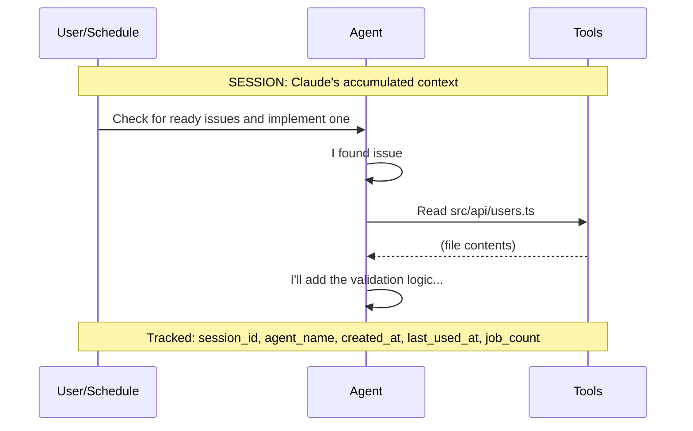

A **Session** represents a Claude Code execution context. Sessions manage conversation history, context persistence, and enable resume and fork capabilities across job executions. Understanding session management is essential for controlling how your agents maintain (or reset) their context over time.

## What is a Session?

When Claude Code executes, it maintains a conversation context—the accumulated history of messages, tool uses, and responses. A session encapsulates this context, allowing herdctl to:

- **Persist context** across multiple job executions
- **Resume** interrupted work from exactly where it left off
- **Fork** existing sessions to explore alternative approaches
- **Isolate** conversations per channel in chat integrations



## Session Configuration

Session behavior is configured with the agent-level `session` block, which accepts three optional keys — `max_turns`, `timeout`, and `model`:

```yaml
session:
  max_turns: 50    # Maximum conversation turns per job
  timeout: 24h     # Session expiry window (default: 24h)
```

| Key | Type | Description |
|-----|------|-------------|
| `max_turns` | number | Maximum conversation turns per job execution. If the top-level agent `max_turns` is also set, the top-level value wins. Setting this also limits the agent to one concurrently running schedule. |
| `timeout` | string | How long a session remains resumable after its last use (e.g. `30m`, `1h`, `24h`, `7d`). Once this window passes, the stored session is treated as expired and the next run starts fresh. Default: `24h`. |
| `model` | string | Accepted by the schema, but the runtimes read the top-level agent `model` setting — set the model there instead. |

:::note
`timeout` is a session **expiry window**, not a job duration cap. It is measured from the session's `last_used_at` timestamp and controls how long herdctl will keep resuming the same Claude session.
:::

## Session Continuity

By default, **every job starts a fresh session** — a scheduled run has no memory of previous runs, and no configuration is needed for that. Continuity is opt-in:

### Per-schedule resume: `resume_session`

Set `resume_session: true` on a schedule to resume the agent's stored session instead of starting fresh:

```yaml
schedules:
  daily-analysis:
    type: cron
    cron: "0 9 * * *"
    prompt: "Continue your codebase analysis from yesterday."
    resume_session: true     # Default: false
```

Each run then continues the same conversation, as long as the stored session is still valid (not expired past `session.timeout`, same working directory, same runtime context).

:::caution
`--resume` causes Claude Code to mark the resumed session as a *sidechain*, which hides it from dashboard session discovery. See [Sidechain Sessions](#sidechain-sessions) below.
:::

### Library triggers: `resume` and `fork`

When triggering jobs programmatically, `FleetManager.trigger()` accepts a `resume` option (continue a specific session) and a `fork` option (branch a new session off an existing one). See [Forking from the Library](#forking-from-the-library) below and the [trigger() reference](/library-reference/fleet-manager/#triggeragentname-schedulename-options).

### Per-channel chat sessions

Chat integrations (Discord, Slack, and the web dashboard) maintain a **separate session per channel**, so context is isolated between channels:

```
Discord #general  → Session A (persists across messages)
Discord #support  → Session B (separate context)
Slack #dev        → Session C (separate context)
```

This is built into the chat connectors — it is not a `session` block setting. Each connector stores its channel-to-session map in `.herdctl/<platform>-sessions/<agent-name>.yaml`, and a channel's session expires after a configurable period of inactivity via `chat.<platform>.session_expiry_hours` (default: 24).

Each chat-enabled agent has its own Discord bot (created in Discord Developer Portal), appearing as a distinct "person" in chat:

```yaml
name: project-support
description: "Answers questions in Discord channels"
working_directory: ./my-project

chat:
  discord:
    bot_token_env: SUPPORT_DISCORD_TOKEN  # This agent's own bot
    session_expiry_hours: 24              # Per-channel session expiry (default: 24)
    guilds:
      - id: "guild-id-here"
        channels:
          - id: "123456789"       # #general
            mode: mention
          - id: "987654321"       # #support
            mode: auto
```

:::note
The web dashboard accepts `web.session_expiry_hours` in config, but its chat session expiry is currently fixed at 24 hours in practice — tracked in [issue #326](https://github.com/edspencer/herdctl/issues/326).
:::

## Session Properties

herdctl tracks one session pointer per agent, stored as JSON in `.herdctl/sessions/`. Each record contains:

| Field | Type | Description |
|-------|------|-------------|
| `agent_name` | string | Qualified name of the agent that owns the session (e.g. `my-agent`, or `herdctl.security-auditor` in composed fleets) |
| `session_id` | string | Claude Code session ID used for resume |
| `created_at` | timestamp | When the session was created (ISO 8601) |
| `last_used_at` | timestamp | Last time the session was used; the expiry window is measured from here |
| `job_count` | number | Number of jobs executed in this session |
| `mode` | enum | Operational mode: `autonomous`, `interactive`, or `review` |
| `working_directory` | string | Working directory when the session was created; a change invalidates the session |
| `runtime_type` | enum | Runtime that created the session: `sdk` or `cli` |
| `docker_enabled` | boolean | Whether Docker was enabled when the session was created |

## Session Lifecycle

There is no explicit session state machine — a stored session is either **valid** (resumable) or it gets **cleared**, and the next job starts fresh. Before resuming, herdctl validates the stored session:

1. **Not expired** — `last_used_at` is within the `session.timeout` window (default: 24 hours)
2. **Same working directory** — the agent's working directory hasn't changed since the session was created
3. **Same runtime context** — the runtime type (`sdk`/`cli`) and Docker setting match what created the session
4. **Transcript exists** (CLI runtime only) — the session file is still present on disk

If any check fails, the stale session is cleared automatically and a fresh session starts; you never need to clean sessions up by hand. When a session is resumed, its `last_used_at` timestamp is refreshed so long-running work doesn't expire mid-execution.

## Resume Capability

Sessions store Claude's conversation context, enabling powerful recovery scenarios:

### Automatic Expiry and Recovery

There is no `auto_resume` toggle — resume behavior is governed by validation and automatic retry:

- **Expiry window** — a session is resumable for `session.timeout` (default: 24 hours) after its last use. Past that, it is cleared and the next run starts fresh.
- **Auto-clear** — expired sessions, sessions whose transcript file is missing (CLI runtime), and sessions whose working directory or runtime context changed are cleared automatically.
- **Retry on failed resume** — if Claude Code reports the session as not found or expired server-side when herdctl attempts `--resume`, herdctl clears the stale pointer and automatically retries the job once with a fresh session.

```yaml
session:
  timeout: 1h    # Only resume sessions used within the last hour
```

### Manual Resume

Resume an agent's session interactively with Claude Code:

```bash
# Resume the most recent session
herdctl sessions resume

# Resume a specific session by ID (supports partial match)
herdctl sessions resume a166a1e4

# Resume by agent name
herdctl sessions resume bragdoc-coder
```

This launches Claude Code in the agent's workspace with the full conversation history restored, allowing you to continue the work interactively.

### Resume Behavior

When a session is resumed:
1. Claude Code loads the full conversation history from the session transcript
2. The new prompt is delivered as the next user turn in that conversation
3. If the resume fails (session missing or expired on the server), herdctl clears the stored session and retries once with a fresh session

```
Run 1:
  Message 1 → Message 2 → Message 3   (session saved)

Run 2 (resumed):
  Message 1 → Message 2 → Message 3 → New prompt → Message 4
```

## Fork Capability

Fork an existing session to explore alternative approaches without affecting the original. Forking is a **library API** — there is no `fork` subcommand in the CLI (the CLI offers `herdctl sessions` and `herdctl sessions resume`).

### Forking from the Library

Programmatically, pass `fork` to `FleetManager.trigger()`. The run resumes the source session's transcript as context but writes all new turns to a **brand-new session ID** (via Claude Code's `--fork-session`), leaving the source session untouched:

```typescript
const job = await manager.trigger('my-agent', undefined, {
  fork: 'source-session-id',        // Mutually exclusive with `resume`
  forkedFrom: 'job-2026-07-01-abc123', // Optional lineage metadata
  prompt: 'Try a different approach from here',
});
```

The child session ID is reported the same way a fresh session's is — on the `system`/`init` message and on the final result. `fork` and `resume` are mutually exclusive; when both are set, `fork` takes precedence. See the [trigger() reference](/library-reference/fleet-manager/#triggeragentname-schedulename-options) for details.

### Fork Use Cases

1. **Experimentation**: Try different solutions without losing progress
2. **A/B Testing**: Compare approaches from the same starting point
3. **Preserving a baseline**: Keep a known-good session untouched while testing risky changes in the fork

A fork always branches from the source session's **current** state — there is no way to fork from an earlier point in the history:

```
Original Session:
  M1 → M2 → M3 → M4 → M5 (unchanged)
                       ↓ fork
Forked Session:        M6' → M7' (different approach)
```

## Streaming Chat Sessions

Beyond one-shot job triggers, herdctl can hold a **live, multi-turn streaming session** with an agent. `FleetManager.openChatSession()` returns a `RuntimeSession` handle that supports sending follow-up turns (`send()`), interrupting a runaway turn without losing the session (`interrupt()`), discovering the available slash commands (`listCommands()`), and switching models mid-conversation (`setModel()`). Slash commands are just user messages — sending `"/compact"` runs the command in-session.

Streaming sessions always run on the SDK runtime, even for `runtime: cli` agents (they share the same auth and on-disk session store); only Docker-wrapped agents are unsupported. This is the primitive behind interactive chat UIs like the web dashboard.

See [openChatSession() in the FleetManager reference](/library-reference/fleet-manager/#openchatsessionagentname-options) for the full API.

## Managed Session Lifecycle (Reaping and Wakes)

A live streaming session keeps a warm `claude` process around (~300 MB each). Sessions opened with `manageLifecycle: true` opt in to herdctl-managed lifecycle:

- **Reap on idle** — the session is closed the instant its turn ends, *unless* it holds live background work (running shells, subagents, monitors). Resuming later recovers the full conversation, and Claude's prompt cache is server-side and survives the reap, so closing an idle session costs only ~0.5s of respawn time.
- **Durable wakes** — timer-class wakeups the agent scheduled in-session (`ScheduleWakeup` one-shots, `CronCreate` recurring crons) would normally die with the `claude` process. Instead, herdctl captures them as durable wake entries in `state.yaml` (`session_wakes`) and re-fires them from its own scheduler loop, resuming the session with the wake's prompt.

Wake semantics:

| Behavior | Rule |
|----------|------|
| One-shot wakes | Fire once, then removed |
| Recurring wakes | Re-arm after each fire; auto-expire **7 days** after capture |
| Timezone | Cron expressions resolve in the **host's local timezone**, not UTC (matching how Claude Code serializes them) |
| Live sessions | A due wake is skipped while its session is still open — the session's own next turn re-captures it |
| Persistence | Wake entries survive fleet restarts (stored in `state.yaml`) |

Consumers that want to deliver woken turns somewhere (e.g. a chat UI) register a handler via `FleetManager.setSessionWakeHandler()`; without one, herdctl drains the woken turn headlessly so recurring wakes keep firing.

See [Session Lifecycle Methods](/library-reference/fleet-manager/#session-lifecycle-methods) for the API and [State Persistence](/architecture/state-management/#session-wakes) for the on-disk format.

## Example Configurations

### Stateless Coder Agent

For a coder that should evaluate each issue fresh, no session configuration is needed — every run starts fresh by default:

```yaml
name: stateless-coder
description: "Implements features without prior context"
working_directory: ./my-project

schedules:
  issue-check:
    type: interval
    interval: 5m
    prompt: "Check for ready issues and implement one."
    # resume_session defaults to false — every run starts fresh

session:
  max_turns: 50              # Cap conversation turns per job
```

### Continuous Research Agent

For an agent that builds knowledge over time, enable `resume_session` on the schedule:

```yaml
name: research-agent
description: "Builds understanding of the codebase over time"
working_directory: ./my-project

schedules:
  daily-analysis:
    type: cron
    cron: "0 9 * * *"
    prompt: |
      Continue your codebase analysis. Review what you learned yesterday
      and explore new areas. Update your findings in research-notes.md.
    resume_session: true     # Continue the same session each day

session:
  timeout: 48h               # Keep the session resumable for 48h between runs
```

Remember that resumed sessions are marked as sidechains and hidden from the dashboard's session list (see [Sidechain Sessions](#sidechain-sessions)).

### Multi-Channel Support Bot

For a support agent handling multiple chat channels (each agent has its own Discord bot). Per-channel session isolation is automatic — no `session` block is needed:

```yaml
name: support-bot
description: "Answers questions across Discord channels"
working_directory: ./my-project

chat:
  discord:
    bot_token_env: SUPPORT_DISCORD_TOKEN  # This agent's own bot
    session_expiry_hours: 24              # Channel sessions expire after 24h idle
    guilds:
      - id: "guild-id-here"
        channels:
          - id: "111222333"
            mode: mention
          - id: "444555666"
            mode: auto
```

### Mixed Continuity per Schedule

`resume_session` is set per schedule, so one agent can mix continuous and fresh runs:

```yaml
name: hybrid-agent
description: "Different session behavior per schedule"
working_directory: ./my-project

session:
  timeout: 24h               # Session expiry window (this is also the default)

schedules:
  continuous-work:
    type: interval
    interval: 30m
    prompt: "Continue working on the current feature."
    resume_session: true     # Resumes the same session each run

  fresh-review:
    type: cron
    cron: "0 9 * * 1"        # Monday mornings
    prompt: "Review the codebase with fresh eyes."
    # resume_session defaults to false — reviews start fresh
```

## Session Storage

Session storage location varies by execution environment:

### Storage Locations

| Environment | Conversation transcript | herdctl session pointer |
|-------------|-------------------------|-------------------------|
| **Local** (SDK or CLI runtime) | `~/.claude/projects/` (managed by Claude Code) | `.herdctl/sessions/<qualified-name>.json` |
| **Docker** | `.herdctl/docker-sessions/<session-id>.jsonl` (mounted into the container) | `.herdctl/sessions/<qualified-name>.json` |

### Session Compatibility

Sessions are tied to the **runtime context that created them**. Each session pointer records `runtime_type` (`sdk` or `cli`) and `docker_enabled`; if either has changed by the next run, validation reports a runtime mismatch, the stored session is cleared, and a fresh session starts:

```yaml
# Job 1
runtime: sdk    # Creates session A

# Job 2 — switching runtime does NOT resume session A
runtime: cli    # Session A cleared (runtime mismatch), fresh session B

# Job 3 — toggling Docker also starts fresh
docker:
  enabled: true # Session B cleared (context mismatch), fresh session C
```

:::tip[Context Isolation]
Runtime and Docker changes invalidate sessions by design — SDK and CLI sessions cannot resume each other, and Docker containers can't see local session files (or vice versa). Whenever you change `runtime` or toggle `docker.enabled`, expect the next job to start fresh.
:::

### Session File Structure

herdctl stores its session state in the project-local `.herdctl/` state directory (default: `.herdctl` in the directory you run herdctl from, overridable with `--state`):

```
.herdctl/
├── sessions/
│   ├── my-agent.json                    # One pointer per agent (qualified name)
│   └── herdctl.security-auditor.json    # Composed-fleet agents use dotted names
├── docker-sessions/                     # Docker session transcripts
│   └── <session-id>.jsonl               # (mounted into containers)
└── discord-sessions/                    # Per-channel chat session maps
    └── support-bot.yaml                 # (also slack-sessions/, web-sessions/)
```

Example session pointer:

```json
{
  "agent_name": "bragdoc-coder",
  "session_id": "a1b2c3d4-5678-90ab-cdef-123456789abc",
  "created_at": "2026-01-15T09:00:00Z",
  "last_used_at": "2026-01-15T10:30:00Z",
  "job_count": 3,
  "mode": "autonomous",
  "working_directory": "/Users/you/projects/myapp",
  "runtime_type": "sdk",
  "docker_enabled": false
}
```

## Session Commands

List and resume Claude Code sessions from the command line:

```bash
# List all sessions
herdctl sessions

# Filter by agent
herdctl sessions --agent bragdoc-coder

# Show full resume commands
herdctl sessions --verbose

# JSON output for scripting
herdctl sessions --json

# Resume the most recent session in Claude Code
herdctl sessions resume

# Resume a specific session (supports partial ID match)
herdctl sessions resume a166a1e4

# Resume by agent name
herdctl sessions resume bragdoc-coder
```

The `sessions resume` command launches Claude Code with `--resume <session-id>` in the agent's configured workspace directory, making it easy to pick up where a Discord bot or scheduled agent left off.

See the [CLI Reference](/cli-reference/#sessions) for complete command options.

## Session Discovery

The sections above describe sessions that herdctl creates and manages directly. But herdctl can also discover sessions it didn't create.

The `SessionDiscoveryService` scans Claude Code's JSONL session files in `~/.claude/projects/` to find every session associated with a working directory that an herdctl agent uses. This means the web dashboard shows a complete picture of all Claude Code activity in a project, not just herdctl-initiated sessions:

- **herdctl sessions** — sessions started through scheduled jobs or interactive web chat
- **Native sessions** — sessions started by running `claude` directly in the terminal, in a project directory that an herdctl agent also uses
- **Full conversation history** — for any discovered session, the dashboard can display the complete message history

This is useful because developers often switch between herdctl-managed agents and direct Claude Code usage in the same project. Session discovery surfaces all of that activity in one place.

## Session Attribution

Every discovered session is attributed to an **origin** that describes how it was started:

| Origin | Description |
|--------|-------------|
| `web` | Started through interactive chat in the web dashboard |
| `discord` | Started by the agent's Discord bot |
| `slack` | Started by the agent's Slack bot |
| `schedule` | Started by a scheduled job (`trigger_type: schedule`) |
| `native` | Started by running `claude` directly in the terminal, in a working directory that an herdctl agent also uses. Jobs with other trigger types (manual, webhook, chat, fork) are also grouped here. These sessions are discovered and displayed but not managed by herdctl. |

Attribution is determined by cross-referencing herdctl's job metadata files and the platform session records under `.herdctl/`. A native session can also be continued interactively from the web dashboard ("ad hoc" continuation) — herdctl then creates a new interactive session that picks up the conversation.

Attribution matters because it tells you at a glance whether a session is something herdctl is responsible for or something a developer started independently. In the dashboard, sessions are labeled with their origin so you can filter and distinguish between managed and unmanaged activity.

## Sidechain Sessions

Claude Code internally marks certain sessions as **sidechain** sessions. These include:

- **Sub-agent sessions** — created by the Task tool, typically single-message prompt-cache warmup sessions
- **Resumed sessions** — sessions started with the `--resume` flag

Sidechain sessions are automatically filtered from the dashboard because they are usually noise. A Task tool sub-agent session might contain only a single "Warmup" message and provides no useful context in the session list.

This filtering has a practical consequence for schedule configuration: herdctl defaults `resume_session: false` in schedule configuration. Setting it to `true` causes Claude Code to mark the resumed session as a sidechain, which hides it from the dashboard. Only enable `resume_session: true` when you need the continuity and are comfortable with the resumed session not appearing in the dashboard's session list.

## Session Names

Sessions are given human-readable names for display in the dashboard and CLI. The naming follows a priority order:

1. **Custom name** — a name manually set by the user through the dashboard
2. **Auto-generated name** — extracted from Claude Code's automatic session summary (stored as `type: "summary"` entries in the session JSONL file)
3. **First message preview** — the first ~100 characters of the first user message in the session
4. **Fallback** — "New conversation"

Auto-generated names are cached in the `SessionMetadataStore` so that session lists load quickly without re-parsing JSONL files on every request. When Claude Code generates a new summary for a session, the cached name is updated on the next discovery pass.

## Related Concepts

- [Jobs](/concepts/jobs/) - Individual executions that use sessions
- [Agents](/concepts/agents/) - Configure session behavior per agent
- [State Management](/architecture/state-management/) - Session persistence details
- [FleetManager API](/library-reference/fleet-manager/#session-management-methods) - Programmatic session management, streaming chat sessions, and forking
- [CLI Reference: sessions](/cli-reference/#sessions) - Full command options for session management
