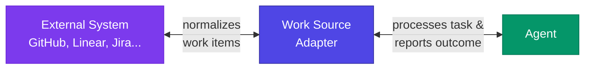
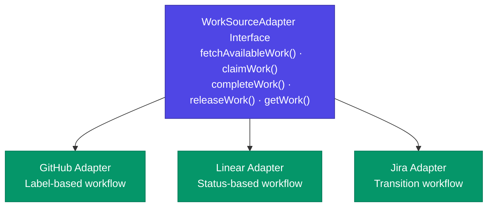
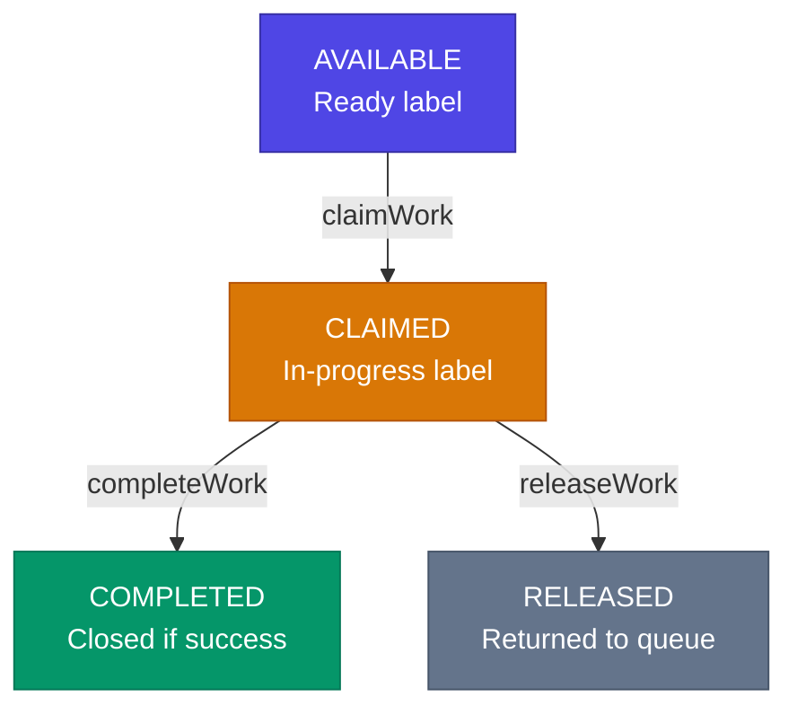

A **Work Source** is an external system that provides tasks for agents to work on. herdctl uses an extensible adapter pattern to integrate with various task management systems like GitHub Issues, Linear, Jira, and more.

## What is a Work Source?

Work sources answer the question: "What should this agent work on?"

While [schedules](/concepts/schedules/) control **when** an agent runs, work sources control **what** the agent works on when it runs.



## The Adapter Pattern

herdctl implements a **pluggable adapter pattern** that enables:

- **Consistent Interface**: All work sources provide the same operations (fetch, claim, complete, release)
- **Source-Specific Logic**: Each adapter handles the unique requirements of its platform
- **Easy Extension**: New adapters can be added without modifying core code
- **Type Safety**: Full TypeScript support for configuration and work items

### How It Works



## Work Items

Regardless of the source, all tasks are normalized into a consistent **WorkItem** structure:

| Field | Type | Description |
|-------|------|-------------|
| `id` | string | Unique identifier (source-prefixed, e.g., `github-123`) |
| `source` | string | The adapter type (`github`, `linear`, etc.) |
| `externalId` | string | Original ID in the external system |
| `title` | string | Task title or summary |
| `description` | string | Full task description or body |
| `priority` | string | `critical`, `high`, `medium`, or `low` |
| `labels` | string[] | Tags/labels from the source system |
| `url` | string | URL to view in the external system |
| `createdAt` | Date | When the task was created |
| `updatedAt` | Date | When the task was last modified |
| `metadata` | object | Source-specific data (assignees, milestones, etc.) |

## Work Item Lifecycle

Every work item follows a standard lifecycle across all adapters:



### Operations

| Operation | Purpose | What Happens |
|-----------|---------|--------------|
| `fetchAvailableWork()` | Get tasks ready for processing | Returns unclaimed tasks matching filters |
| `claimWork(id)` | Reserve a task for this agent | Marks task as in-progress, preventing others from claiming |
| `completeWork(id, result)` | Report task outcome | Posts results, closes task on success |
| `releaseWork(id, options)` | Return task to queue | Removes in-progress status, optionally re-adds ready status |
| `getWork(id)` | Fetch a specific task | Returns the task details |

## Supported Adapters

### GitHub Issues (Available Now)

The GitHub adapter uses **labels** to track work item state:

- **Ready Label**: Marks issues available for agents (default: `ready`)
- **In-Progress Label**: Applied when an agent claims work (default: `agent-working`)
- **Exclude Labels**: Issues with these labels are skipped (default: `blocked`, `wip`)

See the [GitHub Issues Configuration Guide](/configuration/github-work-source/) for detailed setup instructions.

### Future Adapters

The following adapters are planned:

| Adapter | Workflow Type | Status |
|---------|---------------|--------|
| **Linear** | Status-based (columns/states) | Planned |
| **Jira** | Status transitions | Planned |
| **Notion** | Database properties | Planned |
| **Beads** | Task queue | Planned |

## Configuration

Work sources are configured at the agent level:

```yaml
# agents/my-coder.yaml
name: my-coder
description: "Implements features from GitHub issues"

workspace: my-project
repo: myorg/my-project

# Work source configuration
work_source:
  type: github
  repo: myorg/my-project
  labels:
    ready: ready-for-dev
    in_progress: agent-working
  exclude_labels:
    - blocked
    - needs-design
  auth:
    token_env: GITHUB_TOKEN

schedules:
  issue-check:
    type: interval
    interval: 5m
    prompt: |
      Check for ready issues and implement the oldest one.
      Create a PR when done.
```

### Configuration Fields

| Field | Type | Required | Description |
|-------|------|----------|-------------|
| `type` | string | Yes | Adapter type (`github`, etc.) |
| `labels` | object | No | Label configuration (adapter-specific) |
| `exclude_labels` | string[] | No | Labels that exclude issues from processing |
| `auth` | object | No | Authentication configuration |

## Priority Inference

Work items include a `priority` field that adapters infer from source-specific signals:

**GitHub**: Priority is inferred from labels:

| Priority | Matching Labels |
|----------|-----------------|
| `critical` | `critical`, `p0`, `urgent` |
| `high` | `high`, `p1`, `important` |
| `medium` | Default (no matching labels) |
| `low` | `low`, `p3` |

Agents can use priority to decide which tasks to work on first.

## Race Condition Handling

When multiple agents share a work source, race conditions can occur when two agents try to claim the same task. herdctl handles this gracefully:

1. **Atomic Claiming**: The adapter attempts to claim atomically
2. **Failure Detection**: If another agent claimed first, the claim returns `already_claimed`
3. **Automatic Retry**: The scheduler can fetch and try the next available task

```yaml
# Two agents sharing the same work source
# agents/coder-1.yaml
name: coder-1
work_source:
  type: github
  repo: myorg/my-project
  labels:
    ready: ready

# agents/coder-2.yaml
name: coder-2
work_source:
  type: github
  repo: myorg/my-project
  labels:
    ready: ready
```

## Related Pages

- [GitHub Issues Configuration](/configuration/github-work-source/) — Detailed GitHub setup guide
- [Agent Configuration](/configuration/agent-config/) — Full agent YAML reference
- [Schedules](/concepts/schedules/) — When agents run
- [Triggers](/concepts/triggers/) — What starts agent execution
- [Jobs](/concepts/jobs/) — Individual agent executions
