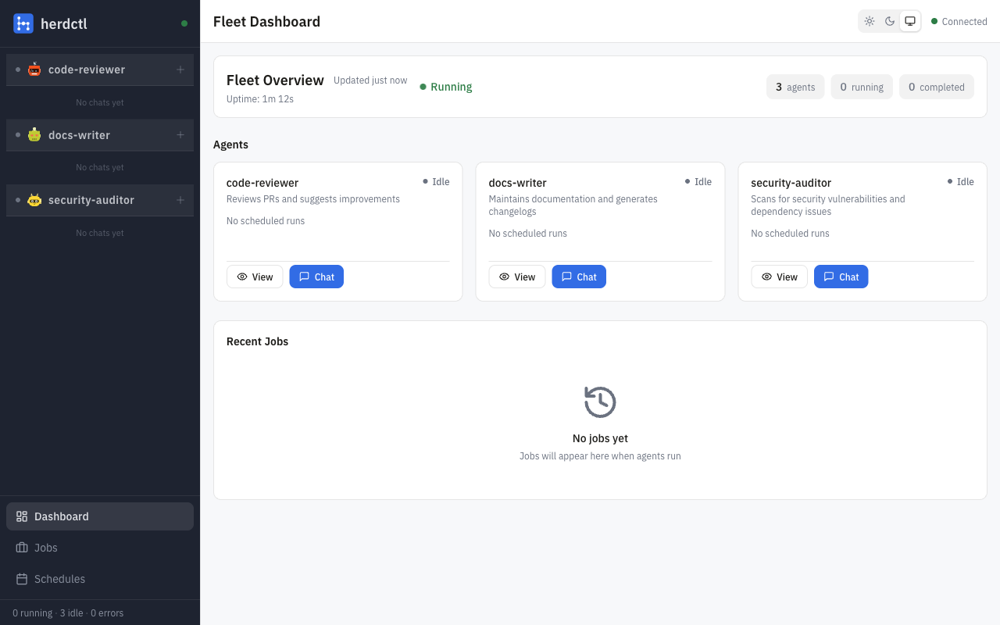
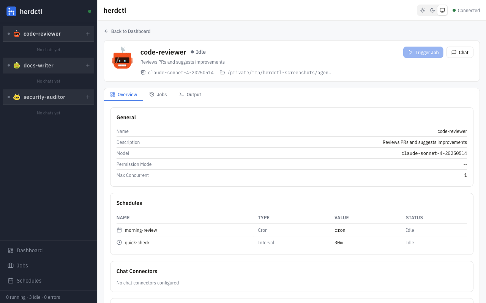
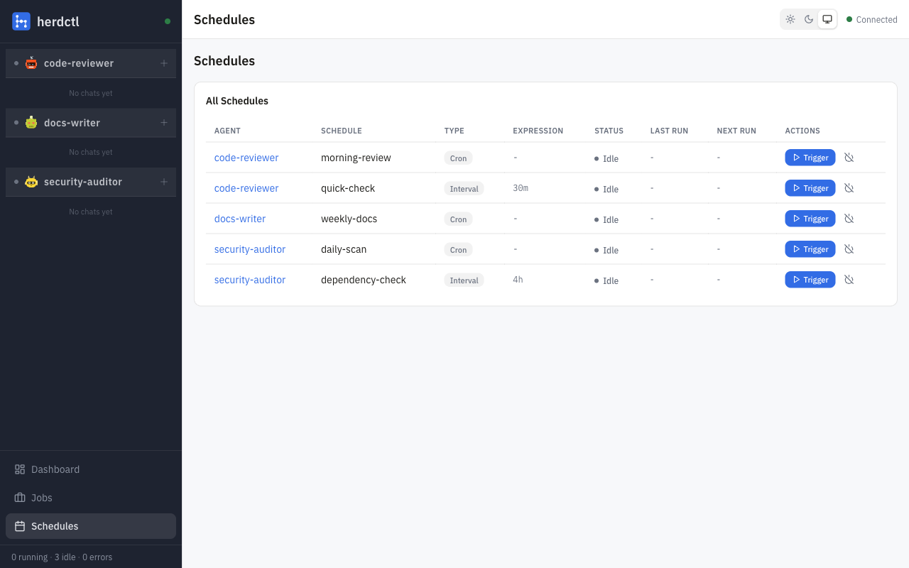
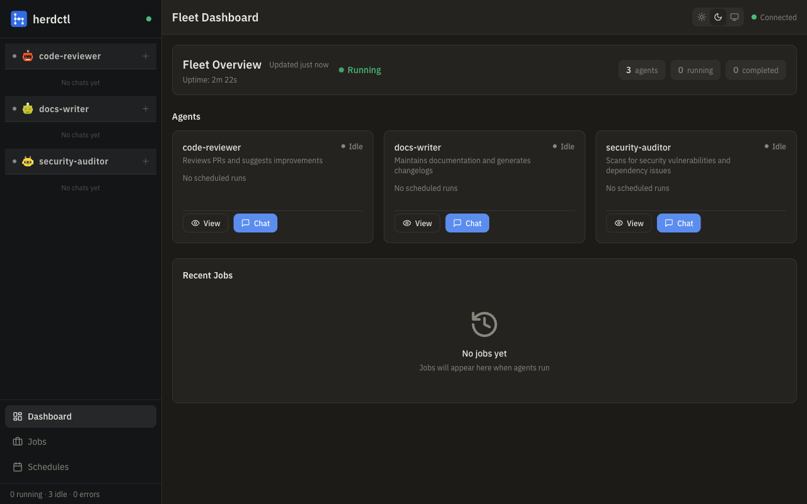

The web dashboard provides a browser-based interface for monitoring your herdctl fleet in real-time, interacting with agents via chat, and managing schedules and jobs.



## Overview

The `@herdctl/web` package embeds a full web dashboard into herdctl. When enabled, it serves a React-based single-page application alongside a REST API and WebSocket server. The dashboard provides:

- **Fleet overview** with real-time agent and job status
- **Agent detail pages** with live output streaming
- **Interactive chat** with agents using persistent sessions
- **Schedule management** with trigger, enable, and disable controls
- **Job management** with cancel, fork, and CLI command copying
- **Theme support** for light, dark, and system preference modes
- **Toast notifications** for action feedback

All updates are pushed to the browser in real-time over WebSocket, so the dashboard always reflects the current fleet state without manual refreshing.

## Enabling the Dashboard

### Configuration File

Add a `web` section to your `herdctl.yaml` fleet configuration:

```yaml
version: 1

fleet:
  name: my-fleet
  web:
    enabled: true
    port: 3232
    open_browser: true
```

| Field | Type | Default | Description |
|-------|------|---------|-------------|
| `enabled` | boolean | `false` | Enable the web dashboard |
| `port` | number | `3232` | Port to listen on |
| `host` | string | `"localhost"` | Host to bind to |
| `session_expiry_hours` | number | `24` | Chat session expiry in hours |
| `open_browser` | boolean | `false` | Automatically open browser when starting |

### CLI Flags

You can also enable the dashboard via CLI flags on `herdctl start`:

```bash
# Enable web dashboard on default port (3232)
herdctl start --web

# Enable on a custom port
herdctl start --web --web-port 8080
```

CLI flags override configuration file settings.

### Accessing the Dashboard

Once the fleet starts with the web dashboard enabled, open your browser to:

```
http://localhost:3232
```

You will see a log message confirming the dashboard URL:

```
[web] Web dashboard available at http://localhost:3232
```

## Dashboard Features

### Fleet Overview

The main dashboard page shows a summary of your fleet at a glance:

- **Fleet state** (running, stopped, etc.) and uptime
- **Agent cards** showing each agent's current status (idle, running, error)
- **Recent jobs** with status indicators
- **Connection indicator** showing WebSocket connectivity

Agent cards display the agent name, current status, running job count, and schedule count. Click an agent card to navigate to its detail page.

### Sidebar Fleet Grouping

When using [fleet composition](/configuration/fleet-config/#fleets), the sidebar groups agents by their fleet hierarchy:

```
▼ herdctl
    ● security-auditor   (running)
    ○ engineer           (idle)
▼ bragdoc
    ○ developer          (idle)
    ○ marketer           (idle)
○ monitor                (idle)
```

- **Fleet sections** are collapsible and show the sub-fleet name
- **Agents within a fleet** display their local name (not the full qualified name)
- **Root-level agents** (those defined directly on the super-fleet) appear ungrouped
- **Status indicators** show running (filled dot) or idle (empty dot) state

Agent URLs use the qualified name (e.g., `/agents/herdctl.security-auditor`), ensuring unique paths even when multiple sub-fleets have agents with the same local name.

### Agent Detail

The agent detail page provides deep visibility into a single agent:



- **Status and metadata** including model, working directory, and permission mode
- **Live output streaming** for the current running job, updated in real-time over WebSocket
- **Schedule list** with controls to trigger, enable, or disable each schedule
- **Job history** for that specific agent
- **Chat connector status** showing Discord, Slack, and web chat states

Output streaming subscribes to the agent's output events via WebSocket, so you see stdout and stderr as they happen.

### Interactive Chat

The chat feature lets you send messages to any agent directly from the dashboard:

- **Create chat sessions** per agent
- **Send messages** and receive streaming responses
- **View message history** with Markdown rendering
- **Tool call visibility** showing when the agent uses tools like Bash, Read, or Write, with collapsible details including input, duration, and output
- **Multiple sessions** per agent for separate conversation threads
- **Session persistence** across page reloads (sessions expire after the configured hours)

Chat messages are sent via WebSocket for low-latency streaming, with the full response appearing incrementally as the agent generates it. Tool calls appear as collapsible UI components in the message feed, allowing you to inspect what the agent did and the results it received.

### Schedule Management

The schedules page lists all schedules across all agents with:



- **Schedule type** (interval, cron, webhook, chat)
- **Current status** (idle, running, disabled)
- **Timing details** (interval, cron expression, last run, next run)
- **Action buttons**:
  - **Trigger** to immediately run an agent
  - **Enable/Disable** to toggle a schedule on or off

### Job Management

The jobs page provides a paginated, filterable list of all jobs:

- **Filter by agent** or **status** (running, completed, failed, cancelled)
- **Pagination** for browsing large job histories
- **Job detail** showing prompt, timing, exit code, and error information
- **Actions**:
  - **Cancel** a running job (graceful or forced termination)
  - **Fork** a completed/failed job to re-run it with optional prompt changes
  - **Copy CLI command** to reproduce the job from the command line

### Theme Support

The dashboard supports three theme modes:

- **Light** - bright background with dark text
- **Dark** - dark background with light text
- **System** - automatically follows your operating system preference

The fleet overview in light and dark mode:

| Light Mode | Dark Mode |
|-----------|----------|
|  |  |

Theme selection persists across sessions via local storage.

## Architecture

The web dashboard consists of:

1. **Fastify server** serving the REST API, WebSocket endpoint, and static SPA files
2. **React SPA** (built with Vite) that communicates with the server
3. **WebSocket connection** for real-time event streaming from FleetManager
4. **Fleet Bridge** that subscribes to FleetManager events and broadcasts them to connected clients

The server registers these API endpoints:

| Endpoint | Method | Description |
|----------|--------|-------------|
| `/api/fleet/status` | GET | Fleet status snapshot |
| `/api/agents` | GET | List all agents |
| `/api/agents/:name` | GET | Single agent details |
| `/api/agents/:name/trigger` | POST | Trigger a job for an agent |
| `/api/jobs` | GET | Paginated job list with filters |
| `/api/jobs/:id` | GET | Single job details |
| `/api/jobs/:id/cancel` | POST | Cancel a running job |
| `/api/jobs/:id/fork` | POST | Fork an existing job |
| `/api/schedules` | GET | List all schedules |
| `/api/schedules/:agent/:schedule/enable` | POST | Enable a schedule |
| `/api/schedules/:agent/:schedule/disable` | POST | Disable a schedule |
| `/api/chat/:agent/sessions` | GET/POST | List or create chat sessions |
| `/api/chat/:agent/sessions/:id` | GET/DELETE | Get or delete a chat session |
| `/api/health` | GET | Health check |
| `/ws` | WebSocket | Real-time event stream |

## Requirements

- **Node.js 18+**
- A modern browser (Chrome, Firefox, Safari, Edge)
- herdctl fleet running with `web.enabled: true`

## Related Pages

- [Fleet Configuration](/configuration/fleet-config/) - Fleet-level configuration reference
- [Agent Configuration](/configuration/agent-config/) - Individual agent settings
- [Jobs](/concepts/jobs/) - How jobs work in herdctl
- [Schedules](/concepts/schedules/) - Schedule types and configuration
