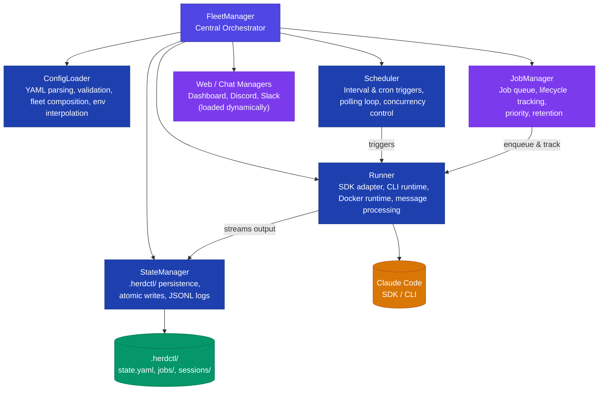

This page describes how the `@herdctl/core` package is structured internally and how FleetManager ties everything together. If you are building on top of herdctl as a library, or contributing to herdctl itself, this is the place to start.

## Architecture Diagram

## Component Overview

| Component | Source | Responsibility |
|-----------|--------|---------------|
| **FleetManager** | `fleet-manager/` | Wires all modules together. Provides the public API surface: lifecycle methods, queries, actions, and events. |
| **ConfigLoader** | `config/` | Discovers `herdctl.yaml`, parses YAML, validates with Zod schemas, resolves fleet composition (sub-fleets), merges defaults, interpolates environment variables. |
| **Scheduler** | `scheduler/` | Polling loop that checks agent schedules (interval and cron). Evaluates trigger conditions, respects concurrency limits, and fires callbacks into FleetManager. |
| **StateManager** | `state/` | Manages the `.herdctl/` directory: fleet state (`state.yaml`), job metadata (YAML), streaming output (JSONL), and session info (JSON). All writes are atomic. |
| **Runner** | `runner/` | Executes agents. The SDK adapter transforms agent config into Claude SDK options. Supports SDK runtime, CLI runtime, and Docker runtime. Streams messages in real time. |
| **JobManager** | `fleet-manager/job-manager.ts` | Manages job lifecycle: creation, queuing, priority, retention, and output streaming. Works with the Runner to track active jobs. |
| **Web / Chat Managers** | `@herdctl/web`, `@herdctl/discord`, `@herdctl/slack` | Dynamically loaded by FleetManager when configured. The web manager serves the dashboard and API; chat managers bridge Discord and Slack to agents. |

## How FleetManager Connects Everything

FleetManager is the single orchestration point. All interaction layers (CLI, Web UI, programmatic library usage) go through FleetManager rather than calling lower-level modules directly.

### Initialization Flow

1. **Load configuration** -- ConfigLoader discovers and parses `herdctl.yaml`, loads all agent configs, resolves fleet composition, and returns a `ResolvedConfig`.
2. **Initialize state directory** -- StateManager creates the `.herdctl/` directory structure if it does not exist.
3. **Create Scheduler** -- A new Scheduler instance is created with a trigger callback that routes back into FleetManager.
4. **Load chat managers** -- FleetManager dynamically imports `@herdctl/discord`, `@herdctl/slack`, and `@herdctl/web` if agents or fleet config reference them. This avoids hard dependencies on optional packages.

### Runtime Flow

1. **Scheduler polls** -- On each tick, the Scheduler checks every agent's schedules against their state (last run time, concurrency limits, enabled/disabled).
2. **Schedule fires** -- When a schedule is due, the Scheduler calls FleetManager's trigger callback with agent and schedule information.
3. **Job created** -- FleetManager creates a job record via JobManager and StateManager, then hands execution to the Runner.
4. **Runner executes** -- The Runner transforms agent config via the SDK adapter, invokes the Claude SDK or CLI, and streams messages back as they arrive.
5. **Output persisted** -- Each message is appended to the job's JSONL file and emitted as a FleetManager event (consumed by the web dashboard, CLI, or library consumers).
6. **Job completes** -- The Runner reports completion. StateManager updates `state.yaml`, and FleetManager emits `job:completed` or `job:failed`.

### Event System

FleetManager extends Node.js `EventEmitter` and provides typed events for every lifecycle transition:

- `initialized`, `started`, `stopped`, `error`
- `job:created`, `job:output`, `job:completed`, `job:failed`, `job:cancelled`, `job:forked`
- `schedule:triggered`, `schedule:skipped`
- `config:reloaded`

This event system is what powers the web dashboard's real-time updates and the CLI's live log streaming.

## Module Composition Pattern

FleetManager uses a **module composition** pattern rather than inheritance. Each area of functionality is extracted into a focused class that receives a `FleetManagerContext` interface:

| Module Class | Responsibility |
|-------------|---------------|
| `StatusQueries` | Fleet status, agent info, schedule info |
| `ScheduleManagement` | Enable/disable schedules |
| `ScheduleExecutor` | Execute triggered schedules |
| `JobControl` | Trigger, cancel, fork jobs |
| `LogStreaming` | Async iterable log streams |
| `ConfigReload` | Hot-reload configuration |

Each module class is instantiated once in the FleetManager constructor and delegates back to the context for shared state access. This keeps each file focused and testable while maintaining a single public API surface.

## Related Pages

- [FleetManager API Reference](/library-reference/fleet-manager/) -- Full API documentation with type signatures and examples
- [Runner Internals](/internals/runner/) -- How agents are executed via the Claude SDK
- [Scheduler Internals](/internals/scheduler/) -- Polling loop, interval parsing, cron support
- [State Management](/internals/state-management/) -- File formats and atomic write guarantees
