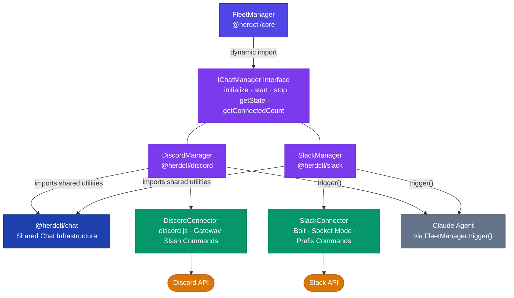
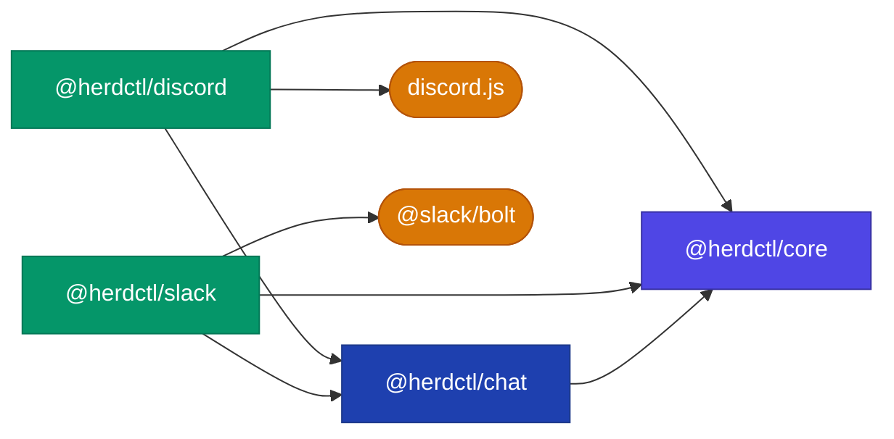
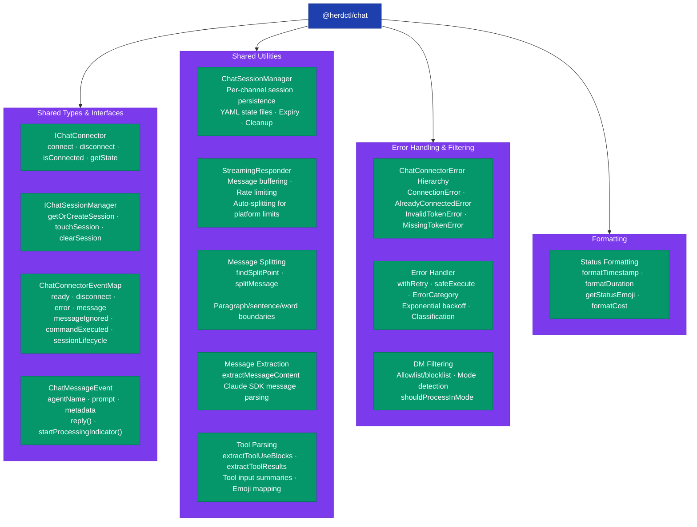
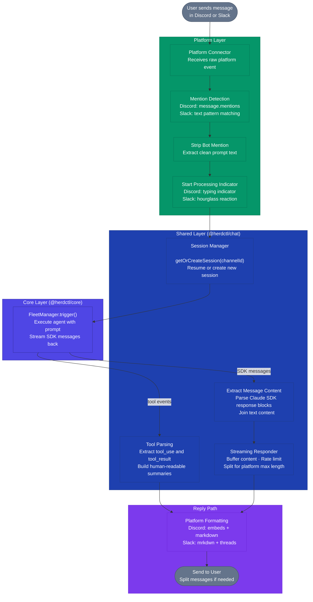

This page describes the internal architecture of herdctl's chat integration layer -- how the `@herdctl/chat` package provides shared infrastructure that both `@herdctl/discord` and `@herdctl/slack` build on. If you are building a new chat connector or contributing to the existing ones, start here.

## Architecture Overview

The chat system follows a **shared abstraction** pattern. Common logic lives in `@herdctl/chat`, platform connectors implement the platform-specific parts, and `@herdctl/core` orchestrates everything through a minimal interface.



## Package Dependency Graph

The dependency flow is strictly one-directional. Platform packages depend on the shared chat package, which depends on core. Core never depends on any chat package -- it discovers managers at runtime via dynamic imports.



## What Lives Where

### `@herdctl/chat` -- Shared Infrastructure

The chat package contains everything that was duplicated between Discord and Slack (roughly 70-80% of the code). No platform-specific SDK imports live here.



### `@herdctl/discord` -- Platform-Specific

The Discord package keeps only what requires discord.js or is unique to Discord's interaction model:

| Component | Purpose |
|-----------|---------|
| **DiscordConnector** | discord.js client, gateway intents, event handler registration |
| **DiscordManager** | Manages multiple connectors, handles message pipeline with tool embeds |
| **CommandManager** | Slash command registration via Discord REST API (`/help`, `/reset`, `/status`) |
| **MentionHandler** | Discord-specific mention detection (`message.mentions`), conversation context building from channel history |
| **AutoModeHandler** | Guild-based channel resolution, DM channel config |
| **ErrorHandler** | Discord-specific error classification (gateway errors, REST rate limits) |
| **Formatting** | `escapeMarkdown()`, typing indicator management |

### `@herdctl/slack` -- Platform-Specific

The Slack package keeps only what requires `@slack/bolt` or is unique to Slack:

| Component | Purpose |
|-----------|---------|
| **SlackConnector** | Bolt App, Socket Mode connection, event handler registration |
| **SlackManager** | Manages connectors, handles message pipeline with file sender MCP |
| **CommandHandler** | Prefix command detection and routing (`!help`, `!reset`, `!status`) |
| **MessageHandler** | Slack-specific mention detection (`<@USERID>` patterns) |
| **ErrorHandler** | Slack-specific error classification (Socket Mode, API errors) |
| **Formatting** | `markdownToMrkdwn()` conversion, `escapeMrkdwn()`, context attachments |

## Message Flow

When a user sends a message in Discord or Slack, it flows through the same pipeline -- with platform-specific entry and exit points but shared processing in between.



### Step-by-Step

1. **Message received** -- The platform connector (DiscordConnector or SlackConnector) receives a raw event from the chat platform's WebSocket connection.

2. **Mention detection** -- Platform-specific logic determines if the bot was mentioned. Discord uses the `message.mentions` API; Slack checks for `<@USERID>` text patterns.

3. **Prompt extraction** -- The bot mention is stripped from the message text, producing a clean prompt.

4. **Processing indicator** -- The platform starts showing activity: Discord sends a typing indicator, Slack adds an hourglass emoji reaction.

5. **Session lookup** -- The shared `ChatSessionManager` looks up or creates a session for this channel. Sessions are stored as YAML files in `.herdctl/<platform>-sessions/` and expire after a configurable number of hours (default: 24).

6. **Agent execution** -- The manager calls `FleetManager.trigger()` with the prompt and session context. The Runner executes the Claude agent and streams SDK messages back.

7. **Content extraction** -- The shared `extractMessageContent()` function parses assistant messages from the Claude SDK, handling both direct string content and arrays of content blocks.

8. **Streaming response** -- The shared `StreamingResponder` buffers content, respects rate limits between sends, and automatically splits messages that exceed platform character limits (2,000 for Discord, 4,000 for Slack).

9. **Platform formatting** -- The reply is formatted for the target platform: Discord uses embeds and markdown; Slack converts to mrkdwn and posts in threads.

10. **Delivery** -- The formatted message is sent back to the user in the same channel or thread.

## Session Management

The `ChatSessionManager` is the strongest shared abstraction -- the Discord and Slack implementations were 95%+ identical before extraction. It is parameterized by platform name, which determines storage paths and session ID prefixes.

| Aspect | Discord | Slack |
|--------|---------|-------|
| Storage path | `.herdctl/discord-sessions/<agent>.yaml` | `.herdctl/slack-sessions/<agent>.yaml` |
| Session ID format | `discord-<agent>-<uuid>` | `slack-<agent>-<uuid>` |
| Expiry default | 24 hours | 24 hours |

Session state is persisted as YAML with atomic writes (write to temp file, then rename) for crash safety. The session manager handles creation, expiry checking, cleanup of stale sessions, and active session counting.

## Dynamic Loading

FleetManager does not have a hard dependency on any chat package. Instead, it discovers which platforms are configured by inspecting agent configs, then dynamically imports the matching package:

```typescript
// Simplified from FleetManager initialization
if (hasDiscordAgents) {
  const mod = await import("@herdctl/discord");
  const manager = new mod.DiscordManager(this);
  await manager.initialize();
}

if (hasSlackAgents) {
  const mod = await import("@herdctl/slack");
  const manager = new mod.SlackManager(this);
  await manager.initialize();
}
```

This means `@herdctl/discord` and `@herdctl/slack` are optional peer dependencies. If a user only needs Slack support, they do not need discord.js installed, and vice versa. The `IChatManager` interface in core defines the contract that both managers satisfy.

## Key Design Decisions

### Composition Over Inheritance

The platform managers use **composition** rather than a base class. Each manager imports and assembles shared utilities (`StreamingResponder`, `extractMessageContent`, message splitting, etc.) explicitly. This was chosen because the Discord and Slack pipelines differ enough -- Discord has tool embed support and rich presence; Slack has file sender MCP integration and mrkdwn conversion -- that a base class would need many template method hooks, making the code harder to follow than explicit composition.

### Platform Connectors Own Platform Code

All platform SDK interactions stay in the platform packages. The shared chat package never imports `discord.js` or `@slack/bolt`. This ensures that:

- Adding a new platform does not affect existing ones
- Platform SDK version upgrades are isolated
- The shared package has minimal dependencies (just `@herdctl/core`, `yaml`, `zod`)

### Session Manager is Parameterized, Not Subclassed

Rather than having `DiscordSessionManager extends ChatSessionManager`, both platforms use `ChatSessionManager` directly with a `platform` parameter. The only differences (storage path, session ID prefix) are handled by string interpolation, not inheritance.

## Related Pages

- [Core Architecture](/internals/architecture/) -- How FleetManager orchestrates all modules
- [Discord Integration](/integrations/discord/) -- Discord setup, configuration, and usage
- [Slack Integration](/integrations/slack/) -- Slack setup, configuration, and usage
- [Sessions](/concepts/sessions/) -- How conversation context works from a user perspective
